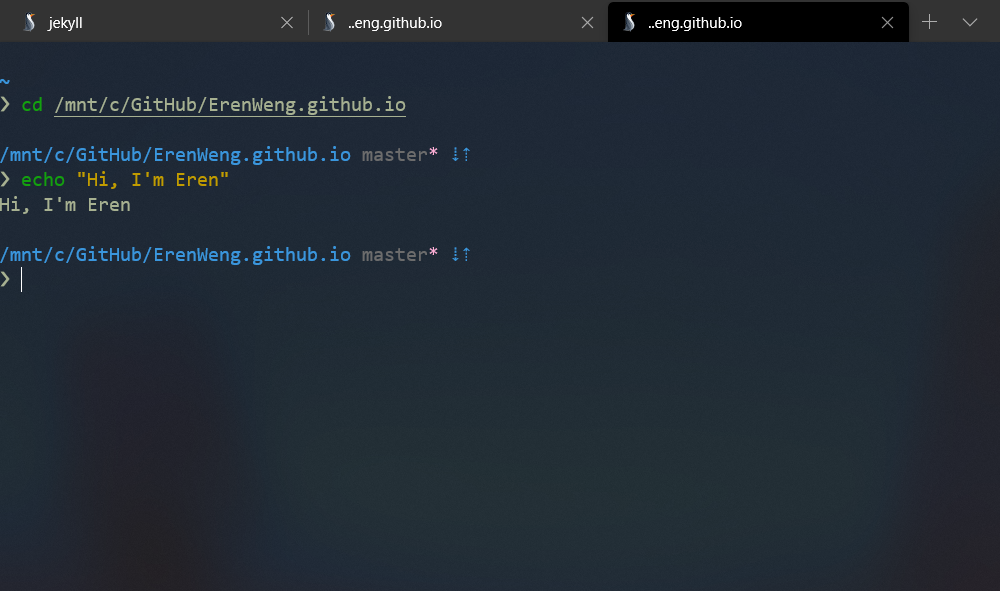

<br>

想要有像這樣的終端機介面嗎？
1. 擁有好用的zsh快捷鍵
2. 清楚明瞭的文字色調
3. 語法高亮
4. 有點毛玻璃微透明的背景
5. 順眼的icon




可以參考以下的步驟

<br>

### 安裝Ubuntu

- 首先要有基本安裝

    1.設備：Windows 10，於Microsoft store下載即可

    2.Ubuntu 18.04 LTS，啟用後會是常見的Bash Shell

    3.git

    &emsp;[git官網](https://git-scm.com/book/zh-tw/v2/%E9%96%8B%E5%A7%8B-Git-%E5%AE%89%E8%A3%9D%E6%95%99%E5%AD%B8)

    4.npm
    
    &emsp;[npm官網](https://www.npmjs.com/get-npm)

<br>

- 系統要更新

```
$sudo apt-get update
$sudo apt-get upgrade
```

<br>

### 安裝 zsh 

- 輸入以下指令

```
$sudo apt-get install zsh
```

<br>

- 檢查是否安裝成功


```
$cat /etc/shells
```
（出現 /usr/bin/zsh 就是安裝成功）

<br>

-  如果我想在bash 和 zsh做切換呢？

    1.修改預設的 Shell為zsh
    ```
    $chsh -s /bin/zsh
    ```

    2.修改預設的 Shell為bash
    ```
    $chsh -s /bin/bash
    ```

<br>

### 安裝 oh-my-zsh

- curl及wget選一個即可

```
#via curl
$sh -c "$(curl -fsSL https://raw.githubusercontent.com/robbyrussell/oh-my-zsh/master/tools/install.sh)"

#via wget
$sh -c "$(wget https://raw.githubusercontent.com/robbyrussell/oh-my-zsh/master/tools/install.sh -O -)"
```

<br>

### 使用樣式 Pure

我之所以會選擇這個樣式，是因為他看起來很簡潔，而且在所有樣式的評分算是不錯的

- 使用npm安裝Pure

[Pure Github](https://github.com/sindresorhus/pure)

```
$ sudo npm install --global pure-prompt
```

現在許多的網頁開發工具都會使用 npm 套件管理程式來安裝，當使用
全域安裝時，如果沒有使用 root 權限，通常都會出現沒有權限的錯誤訊息，所以在這邊前面才加上了sudo

<br>

- 找個地方建立資料夾，複製Pure 的repo

```
mkdir -p "$HOME/.zsh"
git clone https://github.com/sindresorhus/pure.git "$HOME/.zsh/pure"
```

<br>

- 修改 .zshrc 文件

這邊根據Pure的官方文件做自己想要的設定

使用vim編輯器進入文件
```
vim ~/.zshrc
```

（如果他有詢問動作，按E進行編輯）<br>
（i 進行編輯，esc 離開編輯，:wq 離開）

<br>

如果沒有加上ZSH_DISABLE_COMPFIX=true會出現以下錯誤：

要修復權限，可以通過禁用"group"和"others"的寫入權限並確保這些目錄的所有者是root或目前的使用者來修復權限。以下命令可能有所幫助：`compaudit | xargs chmod g-w，o-w` 。如果沒有，或者你想跳過不安全目錄的驗證，你可以在zshrc文件中找到oh-my-zsh，將變數ZSH_DISABLE_COMPFIX設置為true。

```

ZSH_DISABLE_COMPFIX=true

#將clone下來的repo加到$HOME/.zshrc的$fpath中
fpath+=$HOME/.zsh/pure

#預設樣式
export ZSH="/home/yourpath/.oh-my-zsh"
ZSH_THEME="robbyrussell"

#初始化提示系統
autoload -U promptinit; promptinit
prompt pure

#個人設定
PURE_CMD_MAX_EXEC_TIME=10
zstyle :prompt:pure:path color cyan
zstyle ':prompt:pure:prompt:*' color white
zstyle :prompt:pure:git:stash show yes
zstyle :prompt:pure:cmd:max:exec:time show yes

```

<br>

### 安裝 zsh-syntax-highlighting

>語法高亮讓打字看起來更加清楚

- 安裝zsh-syntax-highlighting

[zsh-syntax-highlighting github](https://github.com/zsh-users/zsh-syntax-highlighting/blob/master/INSTALL.md)

```
git clone https://github.com/zsh-users/zsh-syntax-highlighting.git

echo "source ${(q-)PWD}/zsh-syntax-highlighting/zsh-syntax-highlighting.zsh" >> ${ZDOTDIR:-$HOME}/.zshrc

#讀取並執行此檔案中的命令
source ~/.zshrc
```

<br>

### 安裝及設定Windows Terminal

於Microsoft Store 安裝 Windows Terminal。安裝成功後打開設定，視窗會跳出 setting.json，貼上以下程式碼。詳細的設定可以到 [windows 終端機中的設定檔設定](https://docs.microsoft.com/zh-tw/windows/terminal/customize-settings/profile-settings) 查詢。

其中的 "icon": 可以自己找圖，然後放在`/mnt/c/Users/你的名字/AppData/Local/Microsoft/WindowsApps/Microsoft.WindowsTerminal_8wekyb3d8bbwe`

```
{
    "$schema": "https://aka.ms/terminal-profiles-schema",
    "defaultProfile": "{78e390db-1bff-4533-9d7c-20f53d8bafa1}",
    "initialRows": 30,
    "initialCols": 120,
    "alwaysShowTabs": true,
    "showTerminalTitleInTitlebar": true,
    "experimental_showTabsInTitlebar": true,
    "profiles": [
        {
            "startingDirectory": "%USERPROFILE%",
            "guid": "{08b5e85b-3615-463d-8df1-70bc4703863f}",
            "name": "CMD",
            "colorscheme": "Campbell",
            "historySize": 9001,
            "snapOnInput": true,
            "cursorColor": "#FFFFFF",
            "cursorShape": "bar",
            "commandline": "cmd.exe",
            "fontFace": "Consolas",
            "fontSize": 12,
            "acrylicOpacity": 0.75,
            "useAcrylic": true,
            "closeOnExit": true,
            "padding": "0, 0, 0, 0",
            "icon": "ms-appdata:///roaming/CMD_32px.png"
        },
        {
            "startingDirectory": "%USERPROFILE%",
            "guid": "{95e05ea2-6bad-4896-bcdf-a4f96c885cc8}",
            "name": "PowerShell",
            "background": "#002731",
            "colorscheme": "Campbell",
            "historySize": 9001,
            "snapOnInput": true,
            "cursorColor": "#FFFFFF",
            "cursorShape": "bar",
            "commandline": "powershell.exe",
            "fontFace": "Consolas",
            "fontSize": 12,
            "acrylicOpacity": 0.5,
            "useAcrylic": false,
            "closeOnExit": true,
            "padding": "0, 0, 0, 0",
            "icon": "ms-appdata:///roaming/powershell_32px.png"
        },
        {
            "guid": "{78e390db-1bff-4533-9d7c-20f53d8bafa1}",
            "name": "Ubuntu",
            "colorscheme": "Campbell",
            "historySize": 9001,
            "snapOnInput": true,
            "cursorColor": "#FFFFFF",
            "cursorShape": "bar",
            "commandline": "wsl ~",
            "fontFace": "Consolas",
            "fontSize": 12,
            "acrylicOpacity": 0.85,
            "useAcrylic": true,
            "closeOnExit": false,
            "padding": "0, 0, 0, 0",
            "icon": "ms-appdata:///roaming/linux_32px.png"
        },
        {
            "guid": "{c6eaf9f4-32a7-5fdc-b5cf-066e8a4b1e40}",
            "hidden": false,
            "name": "Ubuntu-18.04",
            "source": "Windows.Terminal.Wsl"
        },
        {
            "guid": "{b453ae62-4e3d-5e58-b989-0a998ec441b8}",
            "hidden": false,
            "name": "Azure Cloud Shell",
            "source": "Windows.Terminal.Azure"
        }
    ],
    "schemes": [
        {
            "name": "Campbell",
            "foreground": "#A7B191", 
            "background": "#0C0C0C",
            "colors": [
                "#0C0C0C",
                "#C50F1F",
                "#13A10E",
                "#C19C00",
                "#0037DA",
                "#881798",
                "#3A96DD",
                "#CCCCCC",
                "#767676",
                "#E74856",
                "#16C60C",
                "#F9F1A5",
                "#3B78FF",
                "#B4009E",
                "#61D6D6",
                "#F2F2F2"
            ]
        },
        {
            "name": "Solarized Dark",
            "foreground": "#FDF6E3",
            "background": "#073642",
            "colors": [
                "#073642",
                "#D30102",
                "#859900",
                "#B58900",
                "#268BD2",
                "#D33682",
                "#2AA198",
                "#EEE8D5",
                "#002B36",
                "#CB4B16",
                "#586E75",
                "#657B83",
                "#839496",
                "#6C71C4",
                "#93A1A1",
                "#FDF6E3"
            ]
        },
        {
            "name": "Solarized Light",
            "foreground": "#073642",
            "background": "#FDF6E3",
            "colors": [
                "#073642",
                "#D30102",
                "#859900",
                "#B58900",
                "#268BD2",
                "#D33682",
                "#2AA198",
                "#EEE8D5",
                "#002B36",
                "#CB4B16",
                "#586E75",
                "#657B83",
                "#839496",
                "#6C71C4",
                "#93A1A1",
                "#FDF6E3"
            ]
        }
    ]
}
```

