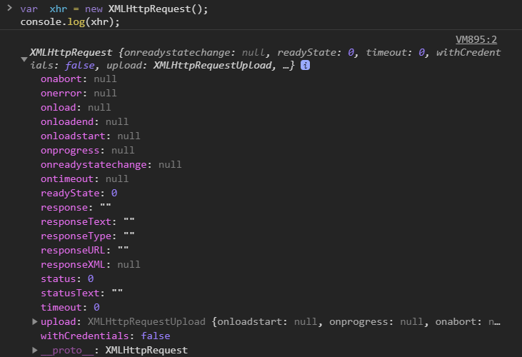

<br>

## AJAX？翻譯翻譯！

AJAX 全名為 `Asynchronous JavaScript and XML`「非同步JS和XML」

### 什麼是同步跟非同步

- 同步處理 ( Synchronous processing model )：
當瀏覽器讀到 `<script>` 標籤時，會停止載入資料，這時瀏覽器需要等待 JavaScript 程式執行，也要等伺服器將資料傳送完成，如果資料傳送時間長，使用者將會有很長一段時間無法操作頁面，且接下去的程式也要等資料傳送完成才能繼續執行。

- 非同步處理 ( Asynchronous processing model )：
當瀏覽器在更新頁面資料時，使用者依舊可以操作頁面元素，例如：搜尋關鍵字時，會自動載入關鍵字清單供選擇。

現在知道非同步處理了，讓我們來看看所謂的AJAX

### AJAX是什麼？

AJAX 是利用 `Javascript`、`XML`及 `XMLHttpRequest`物件 等技術來完成非同步處理的模型，如果你有聽過單頁網頁 SPA ( Single page web application ) 便是使用這些技術及這項模型，網頁只將需要更新的部分做重新渲染，讓你在做任何動作時都在同一頁就能完成。

然現今的AJAX技術大多是使用 `JSON` 檔去傳輸資料，鮮少會再使用 `XML`

### AJAX 的過程

1. 觸發事件（例：按了某按鈕）
2. 使用 Javascript 來產生 `XMLHttpRequest` 物件實體
3. 通過 `XMLHttpRequest` 實體發送 HTTP 請求
4. 伺服器接收並處理請求
5. 伺服器將處理結果和 `Response` 回傳至瀏覽器
6. 使用 Javascript 接收回傳的處理結果


[圖片來源 AJAX Introduction](https://www.w3schools.com/js/js_ajax_intro.asp)


------


大致上知道AJAX的流程後，接下來就要來了解 `XMLHttpRequest` 這個物件在做什麼

### XMLHttpRequest 方法

- 產生實體化

使用 `XMLHttpRequest`物件 發出 HTTP 請求，首先要先實體化物件

```js
<script>
  var xhr = new XMLHttpRequest () ;
  console.log(xhr);
</script>
```

- 客製化請求：open

>　open ( method, url, async )

1. method: 發送請求的方法是 GET 還是 POST
2. url: 發送的檔案網址/位置
3. async: 非同步嗎？（true or false）

```js
xhr.open('get','url',true);
```

- setRequestHeader：設定內容的類型

> setRequestHeader(header, value)

1. header：HTTP的頭部欄位名稱

  祥見 [HTTP header fields](https://zh.wikipedia.org/wiki/HTTP%E5%A4%B4%E5%AD%97%E6%AE%B5)

2. value：網際網路媒體型式

  通常是使用Content-type 來請求的多媒體類型，祥見 [媒體類型](https://zh.wikipedia.org/wiki/%E4%BA%92%E8%81%94%E7%BD%91%E5%AA%92%E4%BD%93%E7%B1%BB%E5%9E%8B)

```js
發送表單類型的資料：
xhr.setRequestHeader('Content-type', 'application/x-www-form-urlencoded');

發送 JSON 類型的資料：
xhr.setRequestHeader('Content-Type','application/json')
```

- 發送請求：send

發送請求至伺服器

如果為 JSON 類型，可先將資料轉成文字再傳送：JSON.stringify(data)

```js
xhr.send();
```


------


### XMLHttpRequest 屬性

可以打開 Chrome DevTools 查看console，嘗試生成 `XMLHttpRequest` 物件並且印出看看有什麼



- readyState

`readystate` 數字所代表的意義：

|數字|意思|意義|
|:-|:-|:-|
|0|UNSENT|有XMLHttpRequest物件，但沒有請求|
|1|OPENED|使用open方法建立請求，但沒有傳送資料|
|2|HEADERS_RECEIVED|使用send方法送出請求，已收到請求|
|3|LOADING|接受請求，資料正在處理中|
|4|DONE|資料處理完成，可以接收資料|

- onreadystatechange

定義一個 `function` 當請求收到答案時要執行的功能

```js
xhr.onreadystatechange = function() {
  if (this.readyState == 4 && this.status == 200) {
    document.getElementById("demo").innerHTML = this.responseText;
  }
};
```

- responseText

回傳的資料以文字/字串呈現

- responseXML

回傳的資料已 XML 呈現

- status

HTTP 狀態，祥見 [HTTP Status Messages](https://www.w3schools.com/tags/ref_httpmessages.asp)

- statusText

回傳 HTTP 狀態的訊息


------


打一次AJAX

```js
const xhr = new XMLHttpRequest();
// 宣告一個 xhr 物件

xhr.open('get', './sample.json', true)
// 使用get方法、API、非同步送出資料

xhr.send(null);
// 送出資料

xhr.onload = () => console.log(xhr.response);
// 成功則執行此函式

xhr.onerror = err => console.log(err);
// 失敗則執行此函式

```


------


隨著Ajax的技術成熟，一些簡化Ajax使用方法的程式庫也相繼問世。AJAX的方法也演進到不只單純的要求與回應，甚至還要能進一步的做資料處理，然而XHR的非同步程式結構並沒有提供這種方法。

接下來將介紹其他函式庫，待續...
