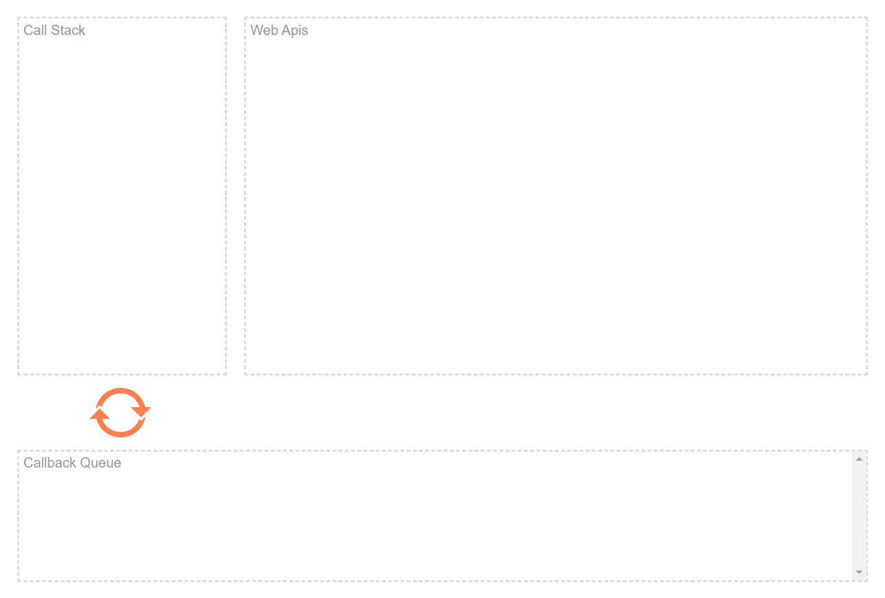

 

## 並行性 concurrency

>指在一個系統中，擁有多個計算 / 事情能夠同時執行的特性，而且他們之間有著潛在的互動
[來源：維基百科](https://zh.wikipedia.org/wiki/%E5%B9%B6%E5%8F%91%E6%80%A7)

`Javascipt` 是單執行緒語言，事件不能同時執行，要能達到像同時執行的 `並行性`，就要有個並行模型（`concurrency model`），也就是讓他能夠同時執行多個事件的模型： `事件循環（event loop）`

## 執行環境概念

在 `Javascript` 執行環境中存在著三個概念，其中的概念也會和事件的存取方式有關，可以先稍微了解一下

- 推疊 Stack

`stack` 的特性，會將事件疊加而後處理，就像在搬東西一樣，通常都是往上疊，再從最上面搬離（pop off）或處理

- 堆積 Heap

`Heap` 讓事件被堆積一個無結構的大區域中，每一小塊都表示佔據一塊記憶體。

這邊先了解這樣就好，之後會再詳細介紹 `Javascipt` `V8`引擎、記憶體內存及清除的部分。

- 佇列 Queue

`Queue` 的特性，會將事件依順序處理，就像在排隊一樣，先到的就會先搬離或處理

## 事件循環 event loop

想了解 `event loop` 可以先去看看 `Philip Roberts` 做的視覺化工具！隨便輸入一些 code 觀察一下事件的流程，你會更清楚 `event loop` 在做什麼，順便看個 `youtube` 講解。

[所以說 event loop 到底是什麼玩意兒？](http://latentflip.com/loupe/?code=JC5vbignYnV0dG9uJywgJ2NsaWNrJywgZnVuY3Rpb24gb25DbGljaygpIHsKICAgIHNldFRpbWVvdXQoZnVuY3Rpb24gdGltZXIoKSB7CiAgICAgICAgY29uc29sZS5sb2coJ1lvdSBjbGlja2VkIHRoZSBidXR0b24hJyk7ICAgIAogICAgfSwgMjAwMCk7Cn0pOwoKY29uc29sZS5sb2coIkhpISIpOwoKc2V0VGltZW91dChmdW5jdGlvbiB0aW1lb3V0KCkgewogICAgY29uc29sZS5sb2coIkNsaWNrIHRoZSBidXR0b24hIik7Cn0sIDUwMDApOwoKY29uc29sZS5sb2coIldlbGNvbWUgdG8gbG91cGUuIik7!!!PGJ1dHRvbj5DbGljayBtZSE8L2J1dHRvbj4%3D)

相信有點進去看的就會看到這張圖是如何解釋事件處理的過程，首先我們要先了解這三個區塊及橘色轉圈 `event loop` 的意義

- Call Stack

Call Stack 區塊具有 `stack` 的特性，會遵守 `LIFO（Last In First Out）` 原則

- Web APIs

Web API 是瀏覽器提供的方法，不屬於 `Javascript` 引擎，會在瀏覽器執行，這就讓事件有辦法同時進行

[有哪些 API 呢？可以看這邊](https://developer.mozilla.org/zh-TW/docs/Web/API)

- Callback Queue

`Callback Queue` 區塊具有 `Queue` 的特性，會遵守 `FIFO（First In First Out）` 原則

`Callback Queue` 裡面會放被呼叫回來執行的 `Web APIs`，如果是函式通常又會稱為回呼函式（callback function），先在這邊等待處理，當 `Call Stack` 有空間時，就會從 `Callback Queue` 拿取最前面的一個事件來進行處理。

- Event Loop

當 Call Stack 為空時，把在 Callback Queue 裡等待的第一個 回呼函式 callback function 放回 stack 中去執行，達到不阻塞的機制。
